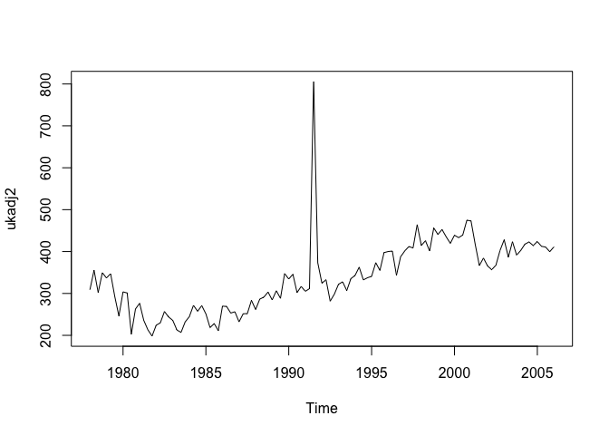
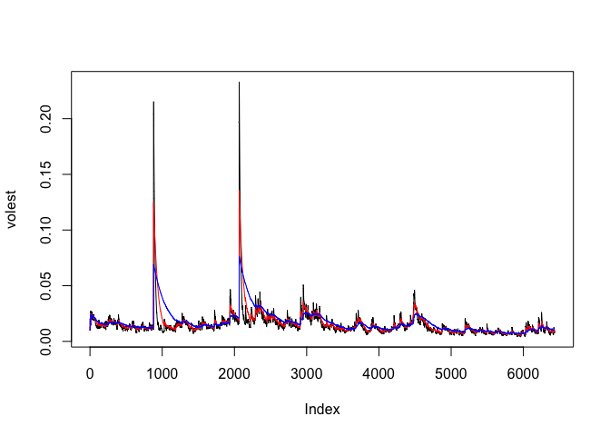

# LiveSession9HomeWork
Rajeev  
July 18, 2016  

#### 1.) Time Series Assignment

```r
library(fpp) #fpp package must be installed first
```

```
## Loading required package: forecast
```

```
## Loading required package: zoo
```

```
## 
## Attaching package: 'zoo'
```

```
## The following objects are masked from 'package:base':
## 
##     as.Date, as.Date.numeric
```

```
## Loading required package: timeDate
```

```
## This is forecast 7.1
```

```
## Loading required package: fma
```

```
## Loading required package: tseries
```

```
## Loading required package: expsmooth
```

```
## Loading required package: lmtest
```

```r
##Q1: - Plot the time series. Can you identify seasonal fluctuations and/or a trend? 
data(ukcars)
plot(ukcars)
```

<!-- -->

```r
#Above plot suggests that there is seasonality and cyclical trend
```


```r
##Q2: - Use a classical decomposition to calculate the trend-cycle and seasonal indices.
#classical decomposition.
fitd <- decompose(ukcars)
plot(fitd)
```

<!-- -->

```r
##Q3: -Do the results support the graphical interpretation from part (a)? 
#Ans:- Yes. Seasonality plot suggests strong seasonality (Third from Top).
```


```r
##Q4: -Compute and plot the seasonally adjusted data. 
ukadj <- seasadj(fitd)
plot(ukadj)
```

<!-- -->

```r
# Above plot shows cyclical trend.
```


```r
##Q5: -Change one observation to be an outlier (e.g., add 500 to one observation), and recompute the seasonally adjusted data. What is the effect of the outlier? 
ukcars2<-ts(c(ukcars[1:54],ukcars[55]+500,ukcars[56:113]),start=c(1978,1),frequency=4)
#ukcars2<-ts(c(ukcars[1:112],ukcars[113]+500),start=c(1978,1),frequency=4)
fitd2 <- decompose(ukcars2)
ukadj2 <- seasadj(fitd2)
plot(ukadj2)
```

<!-- -->

```r
##Q6: -	Does it make any difference if the outlier is near the end rather than in the middle of the time series? 

#Ans:- Outlier in the middle of the data flatens the cyclical trend. However, at the end, it doesn't impact much on overall trend.
```


```r
##Q6: -	STL Decomposition ("Seasonal and Trend decomposition using Loess")
fit <- stl(ukcars, s.window=5)
plot(fit)
```

<!-- -->

```r
plot(ukcars, col="gray",
  main="UK Cars",
ylab="New orders index", xlab="")
lines(fit$time.series[,2],col="red",ylab="Trend")
```

<!-- -->

####2.) Stock Assignment


```r
##Load Time Series Library
library(tseries)

#Download Data for MCD Stock
SNPdata<-get.hist.quote('MCD',quote="Close")

#Cacluate Logarithmic Stock Return
SNPret <- log(lag(SNPdata)) - log(SNPdata)

#Volatility for 250 Days of Trading Days
SNPvol <- sd(SNPret) * sqrt(250) * 100
SNPvol
```

```
## [1] 31.26271
```


```r
## Define volatility Function, d is weight.

Vol <- function(d, logrets)
{
	var = 0
	lam = 0
	varlist <- c()
	for (r in logrets) {
		lam = lam*(1 - 1/d) + 1
	var = (1 - 1/lam)*var + (1/lam)*r^2
		varlist <- c(varlist, var)
	}
	sqrt(varlist)
}
```


```r
# Volatility Estimate 10% Weight
volest <- Vol(10,SNPret)

# Volatility Estimate 30% Weight
volest2 <- Vol(30,SNPret)

# Volatility Estimate 100% Weight
volest3 <- Vol(100,SNPret)

# Plotting above three Volatility Estimate 
plot(volest,type="l")
lines(volest2,type="l",col="red")
lines(volest3, type = "l", col="blue")
```

<!-- -->


